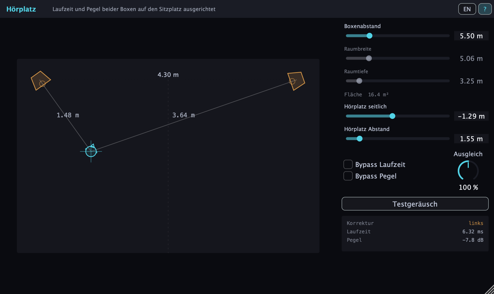
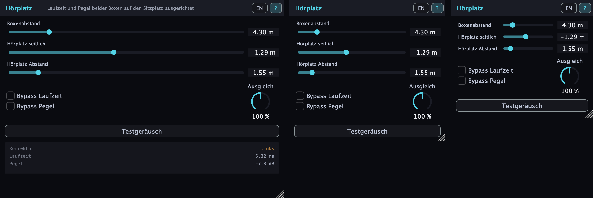

# Hörplatz

**Zwei Boxen, ein Sessel, und der steht selten in der Mitte.**
Hörplatz rechnet aus, wie weit jede Box von deinem Platz entfernt ist, und
gleicht den Unterschied aus: die nähere Box wird verzögert und leiser
gemacht, bis beide gleichzeitig und gleich laut bei dir ankommen. Die Mitte
sitzt dann wieder in der Mitte - auch schräg im Raum, auch auf dem Sofa an
der Seite.



Audio Unit, VST3 und Standalone für macOS. Gebaut mit JUCE.

## So geht's

Links siehst du deinen Raum von oben. **Beide Boxen und dein Platz lassen
sich einzeln ziehen** - so baust du deine Aufstellung nach, auch wenn sie
schief ist, weil ein Schrank im Weg steht. Ein Klick daneben setzt den
Hörplatz, ohne zielen zu müssen.

Der Kopf dreht sich dabei in die Richtung, in der die Phantommitte für
diesen Platz genau vor dir liegt - so herum sitzt du am besten. Die beiden
Linien zeigen die Weglängen, die dickere ist die längere: sie gibt den Takt
vor, an ihr richtet sich die andere aus. Die dünn gestrichelte Linie ist die
Mittelsenkrechte zwischen den Boxen - überall darauf hörst du symmetrisch.

**Die Regler**

| | |
|---|---|
| Boxenabstand | zieht beide Boxen um ihre gemeinsame Mitte auseinander; folgt umgekehrt, wenn eine Box verschoben wird |
| Raumbreite, Raumtiefe | dein Raum; die Fläche steht darunter |
| Hörplatz seitlich, Abstand | dein Platz, gemessen von der Mitte der vorderen Wand |
| Bypass Laufzeit | lässt die Verzögerung unangetastet |
| Bypass Pegel | lässt die Lautstärke unangetastet |
| Testgeräusch | scharfe Impulse zum Einrichten; verdünnt sich beim Ausschalten ins Stereobild |
| Ausgleich | wie weit die Pegelkorrektur geht; 100 % = `1/r` |

Die beiden Bypass-Schalter sind zum Vergleichen da: einmal mit, einmal ohne.
Der Unterschied ist deutlicher, als man erwartet.

Unten rechts steht knapp, was gerade passiert: welche Seite korrigiert wird
und um wieviel - Verzögerung in Millisekunden, Absenkung in Dezibel.

**Zum Einrichten: das Testgeräusch.** Der Schalter ganz unten spielt kurze,
scharfe Impulse aus rosa Rauschen, auf beiden Kanälen identisch. Die Flanke
steht praktisch senkrecht - daran hängt alles: ein weicher Einsatz
verschmiert Laufzeitunterschiede unterhalb weniger Millisekunden, und genau
die will man hier beurteilen. Der kurze Nachhauch dahinter trägt das breite
Band für den Pegel. Stimmt die Einstellung, steht das Geräusch als ein
einziger Punkt zwischen den Boxen; stimmt sie nicht, wandert oder verschmiert
er. Zwischen den Impulsen ist Ruhe, damit man es lange nebenher laufen lassen
kann. Solange es läuft, tritt die Musik zurück.

Beim Ausschalten hört es nicht auf, sondern verdünnt sich: die Impulse rücken
zusammen und gehen abwechselnd nach links und rechts - der erste steht noch
in der Mitte, die folgenden immer weiter draußen, bis die Auslenkung nach
400 ms voll ist. Jeder bekommt Laufzeit **und** Pegel seiner Position, denn
im Kopfhörer trägt die Laufzeit die Ortung; bloß unterschiedliches Rauschen
klingt diffus im Kopf, nicht weit außen. Dazu macht ein Tiefpass zu, und das
Ganze klingt über gut zwei Sekunden aus. Der Knopf leuchtet nach, solange die
Fahne steht; danach kommt die Musik zurück.

**Wenn es klein werden soll**, zieh das Fenster einfach zusammen: was nur der
Übersicht dient, weicht zuerst. Erst geht der Grundriss - und mit ihm die
Raummaße, die ohne ihn nichts mehr bedeuten -, dann das Zahlenfeld, zuletzt
rücken Beschriftung und Regler in eine Zeile zusammen. Übrig bleibt, womit
man wirklich einstellt: Boxenabstand, Hörplatz, die beiden Bypässe mit dem
Ausgleich und das Testgeräusch. Am Ende passt das auf 300 × 250 Punkte.



Dass Raummaße und Zahlenfeld weicher und kleiner gezeichnet sind als der
Rest, hat denselben Grund: mit ihnen stellt man nichts ein.

Oben rechts sitzen zwei Schalter: **EN/DE** stellt die Sprache um, **?**
schaltet die Hilfetexte ein und aus, die beim Verweilen über einem
Bedienelement erscheinen. Beides wird mit dem Projekt gespeichert.

Ausgelegt ist das Ganze auf Räume von 5 bis 90 m², die Regler reichen weiter,
falls du mehr brauchst.

## Was dahintersteckt

Gerechnet wird nur der Direktschall, ohne Wände und ohne Reflexionen - für
die Ortung ist der erste Schall entscheidend, alles danach kommt zu spät.

- **Weglänge** zu jeder Box, schlicht aus der Geometrie - die Boxen
  stehen frei im Raum, symmetrisch müssen sie nicht sein.
- **Verzögerung:** die nähere Box wartet, bis die weitere eingeholt hat,
  also `(dmax - d) / 343 m/s`. Verzögert wird immer nur - Schall vorziehen
  kann niemand.
- **Pegel:** der Schalldruck fällt mit `1/r`, die nähere Box muss also im
  Verhältnis der Weglängen leiser sein. Verteilt wird das auf beide Seiten -
  die nähere geht um die halbe Spanne herunter, die fernere um dieselbe
  halbe Spanne herauf. Das Produkt beider Faktoren bleibt 1, die
  Gesamtlautstärke ändert sich also nicht, wenn der Hörplatz wandert. Der
  Preis dafür ist Headroom: ein Kanal wird angehoben, bei großen Werten um
  einige Dezibel. Übersteuert er dabei, färbt sich die betroffene Box im
  Grundriss und klingt langsam zurück - so sieht man auch den kurzen
  Ausschlag, den man sonst verpasst.
- **Ausgleich:** das `1/r` gilt im Freien. In einem Raum kommt Diffusschall
  dazu, der Pegel fällt flacher ab als 6 dB pro Abstandsverdopplung - die
  volle Korrektur ist dann zu viel und die Mitte kippt zur ferneren Box.
  Der Regler skaliert deshalb den Dezibelwert: `(d/dmax)^n` mit n zwischen 0
  und 2.

  Wie groß der Unterschied ist, zeigt ein Platz dicht an der linken Box:
  Wege von 0,9 m und 4,6 m, Verhältnis 5:1. `1/r` verlangt dafür -14,0 dB.
  Gehört richtig waren -4,2 dB, also 30 % - und das ist keine Geschmacks-
  sache, sondern der Diffusschall: rechnet man mit Direkt- **und**
  Diffusanteil, entspricht dieser Wert einem Hallradius von rund 1,2 m, wie
  ihn ein normal möbliertes Zimmer hat. Deshalb steht die Vorgabe auf 30 %
  und nicht auf der reinen Lehre. Über 100 % lässt sich die Mitte bewusst
  überziehen.

Der Laufzeitunterschied kann nie größer werden als der Boxenabstand geteilt
durch die Schallgeschwindigkeit - bei 12 m Abstand sind das 35 ms.

Die Verzögerung ist der Zweck des Plugins, keine Latenz zum Wegrechnen: die
DAW bekommt nur die vier Samples gemeldet, die die Interpolation als Sockel
braucht.

## Bauen

```
cmake -B build -DCMAKE_BUILD_TYPE=Release
cmake --build build -j 8
ctest --test-dir build --output-on-failure
```

JUCE wird aus `~/Documents/JUCE` eingebunden; ein anderer Ort geht über
`-DJUCE_DIR=...`. Die fertigen Bündel liegen danach unter
`build/Hoerplatz_artefacts/Release/`.

Audio Unit installieren und prüfen:

```
tools/install-au.sh
auval -v aufx Hp01 Dpnk
```

Das Skript räumt eine vorhandene Fassung erst weg und signiert die neue
ad-hoc. Kopiert man stattdessen über ein schon installiertes Bundle, bleibt
ein `_CodeSignature` zurück, das nicht mehr zum Inhalt passt - macOS schießt
den ladenden Host dann mit „Code Signature Invalid" ab, und im Host dreht
sich nur der Ladekreisel.

## Wo es erprobt ist

Gebaut und benutzt wird es auf **macOS als Audio Unit, in Audio Hijack**.
Genau das ist geprüft, samt `auval`. VST3 und Standalone entstehen beim Bauen
mit, sind aber in keinem Host ausprobiert worden, und Windows oder Linux
standen nie zur Debatte.

Die Audio Unit ist **ad-hoc signiert**. Auf dem eigenen Rechner reicht das;
auf einem fremden blockt Gatekeeper, dafür bräuchte es eine Developer-ID und
Notarisierung.

## Prüfungen

- `geometry_check` - die reine Rechnung ohne JUCE: Symmetrie, das
  1/r-Verhältnis, 60° beim gleichseitigen Dreieck und die Grenze des
  Laufzeitunterschieds über ein Raster von Positionen.
- `audio_check` - ein Impuls durch das fertige Plugin: Lage und Höhe in
  beiden Kanälen, auch mit den beiden Umgehungen.
- `tone_demo datei.wav [sekunden]` - schreibt das Testgeräusch samt
  Ausklang in eine WAV-Datei, die Ohrprobe ohne Host.
- `ui_shot bild.png w=940 h=560 scale=2 lx=-2.9 ly=0.4 rx=2.7 ry=1.6 x=-2 y=3.4` -
  zeichnet die Oberfläche in eine PNG-Datei, ohne dass ein Fenster aufgeht.
  Das Bild oben stammt daher.

## Lizenz

GPL-3.0, siehe [LICENSE](LICENSE).
